# ML Particle Pulse Reconstruction

Machine-learning pipeline for signal deconvolution and pulse reconstruction in Micromegas particle detector waveforms.

This project studies how to reconstruct detector events from digitized signals where several pulses may overlap in time. The work starts from a simple fixed-transfer-function approximation, solves that case with least squares, and then moves toward a more realistic variable-transfer-function scenario where machine learning becomes necessary.

The final approach combines:

- synthetic detector-like signal generation,
- fixed-transfer-function least-squares reconstruction,
- variable-transfer-function modeling,
- Encoder-Decoder-Regressor neural networks,
- a specialist Transformer-based architecture,
- constrained output activations,
- post-prediction numerical refinement,
- ROOT waveform reading.

---

## Table of Contents

- [Overview](#overview)
- [Detector Context](#detector-context)
- [Repository Structure](#repository-structure)
- [Signal Model](#signal-model)
- [Synthetic Data Generation](#synthetic-data-generation)
- [Fixed Transfer Function](#fixed-transfer-function)
- [Fixed-Function Results](#fixed-function-results)
- [Variable Transfer Function](#variable-transfer-function)
- [Encoder-Decoder-Regressor Model](#encoder-decoder-regressor-model)
- [EDR Results](#edr-results)
- [Specialist Transformer Model](#specialist-transformer-model)
- [Output Activations](#output-activations)
- [Post-Prediction Refinement](#post-prediction-refinement)
- [Transformer Results](#transformer-results)
- [ROOT Data Reading](#root-data-reading)
- [Pretrained Models](#pretrained-models)
- [How to Run](#how-to-run)
- [Requirements](#requirements)
- [Suggested Workflow](#suggested-workflow)
- [Future Work](#future-work)
- [Main Concepts](#main-concepts)
- [Notes](#notes)
- [Figure List](#figure-list)

---

## Overview

In many detector systems, the measured waveform is not a direct list of individual physical events. Instead, each event produces a detector response, and the recorded signal is the convolution of the underlying event sequence with the detector transfer function.

When several events occur close in time, their responses overlap. A single visible peak may therefore correspond to more than one physical event.

The goal of this project is to reconstruct the hidden event parameters from the measured waveform.

The reconstructed quantities are mainly:

```text
t0  event arrival time
A   event amplitude
a   transfer-function decay parameter
b   transfer-function shape parameter
```

The project is organized as a progression of methods:

```text
fixed transfer function
        ↓
least-squares deconvolution
        ↓
variable transfer function
        ↓
Encoder-Decoder-Regressor
        ↓
specialist Transformer model
        ↓
post-prediction numerical refinement
```

---

## Detector Context

Micromegas detectors produce digitized electronic signals associated with particle interactions. In realistic acquisition conditions, multiple events can contribute to the same measured waveform.

This creates a deconvolution problem:

```text
measured signal = detector response * event sequence + noise
```

The objective is to infer the original events from the convoluted detector signal.

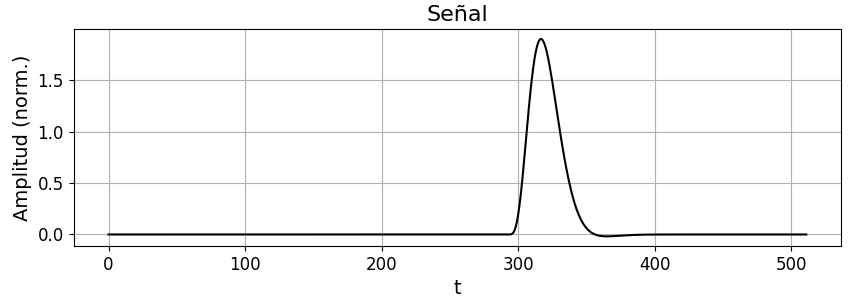

A reconstructed event sequence should identify where the underlying pulses are located and estimate their amplitudes.

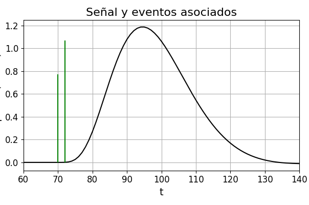

---

## Repository Structure

```text
ml-particle-pulse-reconstruction/
├── src/
│   ├── activations.py
│   ├── architecture_visualizer.py
│   ├── deconvolution.py
│   ├── result_reader.py
│   ├── root_reader.py
│   ├── sampler.py
│   ├── signal_generator.py
│   └── transformer_model.py
│
├── models/
│   ├── best_model.keras
│   ├── transformer_10_25_5.keras
│   └── transformer_10_25_5perc.keras
│
├── figures/
│   ├── activation_clip_t0.png
│   ├── activation_sigmoid_ab.png
│   ├── activation_softmax_amplitude.png
│   ├── convolved_signal_problem.png
│   ├── edr_decoder.png
│   ├── edr_encoder.png
│   ├── edr_fixed_class_accuracy.png
│   ├── edr_fixed_delta_count_error.png
│   ├── edr_variable_confusion_matrix.png
│   ├── edr_variable_delta_count_error.png
│   ├── fixed_single_delta_fit.png
│   ├── fixed_transfer_amplitude_error.png
│   ├── fixed_transfer_time_error.png
│   ├── objective_signal_events.png
│   ├── transformer_ab_branch.png
│   ├── transformer_amplitude_branch.png
│   ├── transformer_coefficient_results.png
│   ├── transformer_error_summary.png
│   ├── transformer_layer_legend.png
│   ├── transformer_shared_block.png
│   └── transformer_t0_branch.png
│
├── data/
├── results/
├── examples/
├── requirements.txt
└── README.md
```

---

## Signal Model

The detector signal is modeled as a sum of shifted detector responses.

Each event is represented by:

```text
t0  arrival time
A   amplitude
C   global scale
a   decay coefficient
b   shape coefficient
```

The transfer function has the form:

```text
H(t) = C exp(-a t) t^b sin(t)
```

with causal clipping so that the response is zero before the event arrival.

The full signal is:

```text
S(t) = sum_i A_i H(t - t0_i; a_i, b_i, C_i) + noise
```

This synthetic setup provides labeled data where the true event parameters are known.

---

## Synthetic Data Generation

The script `src/signal_generator.py` generates labeled detector-like signals.

The generated dataset includes:

- random number of pulses,
- random event times,
- random amplitudes,
- fixed or variable response parameters,
- optional noise,
- fixed waveform length of 512 samples.

The synthetic generation step is important because it provides supervised labels for a problem where real detector labels may be difficult to obtain.

Training data is generated at runtime, so no external dataset is required for the synthetic training pipeline.

---

## Fixed Transfer Function

The first stage assumes that the detector transfer function is fixed and known.

Under this assumption, the problem becomes much simpler. A first fit assuming a single event is used to estimate the center and scale of the group of pulses.

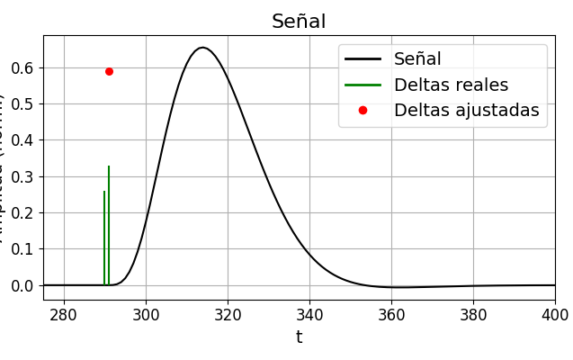

Once a compact time window is defined, the problem can be written as a linear system:

```text
M A ≈ Y
```

where:

- `Y` is the measured waveform,
- `M` contains shifted copies of the known transfer function,
- `A` contains the unknown pulse amplitudes.

This can be solved efficiently using least squares.

The fixed-transfer-function case is therefore not a machine learning problem. It is a classical deconvolution baseline.

---

## Fixed-Function Results

For the fixed transfer function, the reconstruction can be solved with high precision.

The timing reconstruction error is essentially negligible in the controlled synthetic scenario.

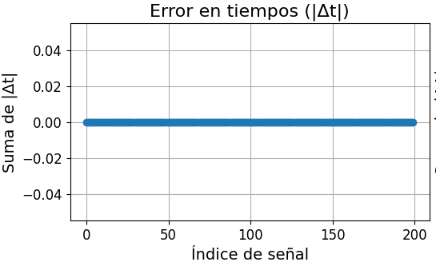

The amplitude reconstruction error is also very small.


This method has clear advantages:

- very accurate under ideal assumptions,
- computationally cheap,
- solved in one least-squares step.

However, it also has limitations:

- the detector response must be known,
- it is sensitive to noise,
- it does not handle event-dependent variations in the transfer function.

This motivates the next stage of the project.

---

## Variable Transfer Function

In the more realistic scenario, the transfer-function parameters are no longer fixed.

The unknowns are no longer only:

```text
t0, A
```

but also:

```text
a, b
```

For `N` events, the number of unknowns increases significantly.

The problem can no longer be solved directly by ordinary least squares because the signal is nonlinear in the response parameters `a` and `b`.

Attempts to linearize the problem through a Taylor expansion lead to poorly conditioned systems.

For this reason, the variable-transfer-function problem is approached using neural networks.

---

## Encoder-Decoder-Regressor Model

The first neural approach is an Encoder-Decoder-Regressor model.

The encoder compresses the original waveform into a lower-dimensional representation.

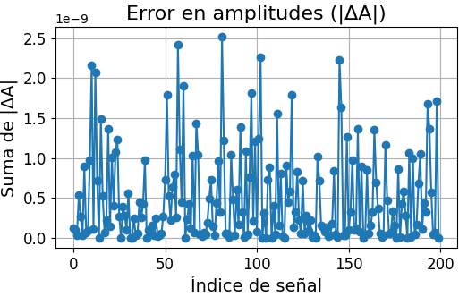

The decoder reconstructs the compressed signal, forming an autoencoder together with the encoder.

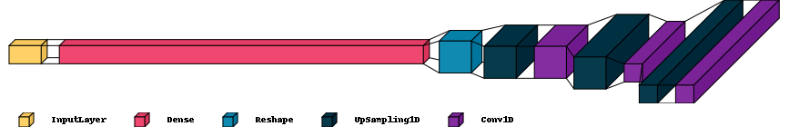

A regression head then uses the latent representation to predict the event parameters.

This model is useful as a first ML baseline because it tests whether a compressed waveform representation contains enough information to reconstruct the hidden pulses.

---

## EDR Results

The EDR model is first tested in a simpler scenario with fixed `a` and `b`.

For this case, the model performs reasonably well.

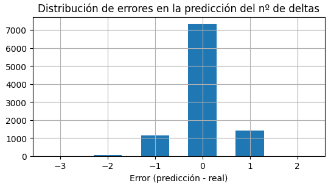

The class-wise behavior gives additional information about how well the model predicts the number of events.

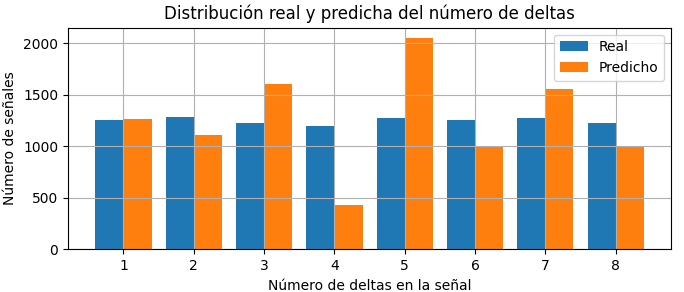

However, when the transfer-function parameters are allowed to vary, the EDR approach becomes less reliable.

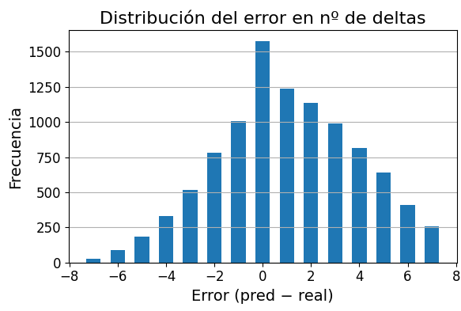

In the variable-transfer-function case, the model tends to predict the maximum allowed number of pulses. This behavior suggests that a more specialized architecture is needed.

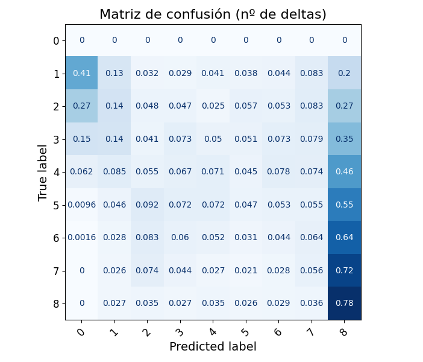

This leads to the development of the specialist Transformer model.

---

## Specialist Transformer Model

The final approach uses a specialist Transformer-like architecture.

The idea is to start from a shared waveform encoder and then separate the prediction into specialized branches.

The shared block processes the input signal and extracts a common representation.


The layer legend for the architecture diagrams is:

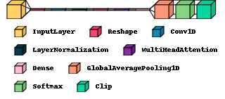

The model then separates the prediction into branches.

### Time branch

The `t0` branch focuses on event arrival times.

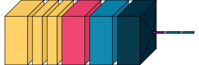

### Amplitude branch

The amplitude branch predicts how the total signal amplitude is distributed across candidate pulses.

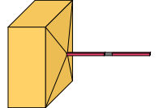

### Shape-parameter branch

The `a,b` branch predicts the transfer-function coefficients.

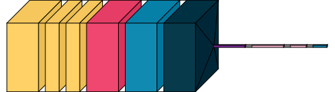

This specialist design is motivated by the fact that each output group has different numerical constraints and different physical meaning.

---

## Output Activations

Different predicted variables require different activation functions.

### Arrival times

Pulse times are constrained to a physical time window:

```text
T_MIN <= t0 <= T_MAX
```

This is implemented using a clipped activation.


### Amplitudes

Amplitudes are positive and must be distributed among candidate pulses.

A softmax-like activation is used to assign relative amplitude weights.

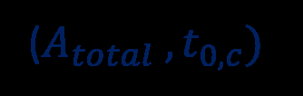

### Transfer-function parameters

The coefficients `a` and `b` vary in a small controlled interval.

A sigmoid-based activation is appropriate because it maps outputs smoothly into a bounded range.

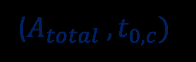

These constraints keep the predictions inside physically meaningful regions and reduce invalid reconstructions.

---

## Post-Prediction Refinement

The Transformer output is used as an initial estimate, not as the final reconstruction.

A nonlinear refinement step is applied after prediction.

The refinement alternates between parameter groups:

```text
1. Fix two parameter groups.
2. Fit the remaining group.
3. Repeat the process for another group.
4. Iterate until convergence.
```

This allows the neural network to provide a good starting point while numerical optimization improves the final fit.

This hybrid approach is useful because the neural network captures the global structure of the signal, while least-squares refinement improves local parameter consistency.

---

## Transformer Results

The Transformer model is tested with:

```text
N_max = 10
```

The prediction errors for time and amplitude are analyzed signal by signal.

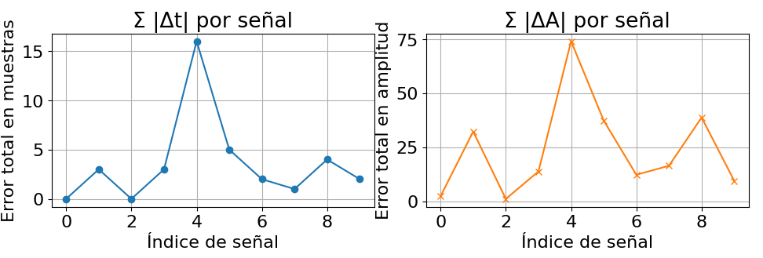

The results show that timing reconstruction is accurate, while amplitude reconstruction remains more difficult.

The transfer-function coefficients `a` and `b` are reconstructed with small residuals.

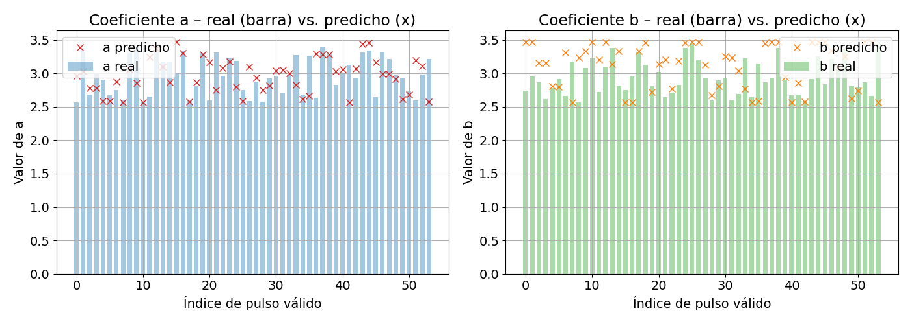

The main result is:

```text
Delta t < 0.6 samples per pulse
```

while the amplitude error is identified as the main bottleneck of the current pipeline.

---

## ROOT Data Reading

The script `src/root_reader.py` demonstrates how to read ROOT detector data using `uproot`.

It loads event arrays such as:

```text
timestamp
signal_ids
signal_values
```

and reconstructs channel-wise sampled waveforms.

This part connects the synthetic reconstruction pipeline with ROOT-based detector data.

ROOT files are not included in the repository.

---

## Pretrained Models

The repository includes pretrained Keras models:

```text
models/
├── best_model.keras
├── transformer_10_25_5.keras
└── transformer_10_25_5perc.keras
```

Recommended default model:

```text
models/best_model.keras
```

New models can be trained using:

```bash
python src/transformer_model.py
```

To resume from an existing checkpoint:

```bash
python src/transformer_model.py --resume
```

If the model files are too large for GitHub, they can be moved to a GitHub Release and referenced from this README.

---

## How to Run

Install dependencies:

```bash
pip install -r requirements.txt
```

Train a new model:

```bash
python src/transformer_model.py
```

Run the sampling and refinement pipeline:

```bash
python src/sampler.py
```

Visualize saved result CSV files:

```bash
python src/result_reader.py
```

Read a ROOT file:

```bash
python src/root_reader.py
```

Generate activation-function plots:

```bash
python src/activations.py
```

---

## Requirements

Main dependencies:

```text
numpy
scipy
pandas
matplotlib
tensorflow
scikit-learn
uproot
visualkeras
```

Install them with:

```bash
pip install -r requirements.txt
```

---

## Suggested Workflow

A typical workflow is:

```text
1. Generate synthetic detector-like signals.
2. Solve the fixed-transfer-function case as a least-squares baseline.
3. Move to variable transfer functions.
4. Train the EDR model as a first ML approach.
5. Train the specialist Transformer model.
6. Refine predictions with nonlinear optimization.
7. Compare reconstructed parameters with ground truth.
8. Optionally read ROOT detector waveforms.
```

---

## Future Work

Possible improvements include:

- testing alternative activation functions for amplitude prediction,
- adding a dedicated head to predict the number of pulses,
- improving the post-processing and refinement stage,
- defining confidence intervals for `a`, `b`, and `t0`,
- applying the pipeline to larger ROOT-based detector samples,
- comparing against sparse deconvolution methods.

---

## Main Concepts

This project covers:

- applied machine learning for detector signals,
- Micromegas detector waveform reconstruction,
- pulse deconvolution,
- fixed-transfer-function least-squares reconstruction,
- variable-transfer-function modeling,
- Encoder-Decoder-Regressor networks,
- Transformer-based regression,
- constrained neural outputs,
- synthetic data generation,
- numerical post-processing,
- ROOT waveform reading.

---

## Notes

This repository is intended as an applied machine learning and detector-signal-processing project.

The goal is not to provide a final production reconstruction framework, but to explore a complete reconstruction workflow from classical deconvolution to neural-network-based reconstruction.

Training data is generated synthetically at runtime.

Large ROOT datasets are not included in the repository.

---

## Figure List

The README expects the following files inside the `figures/` folder:

```text
figures/
├── activation_clip_t0.png
├── activation_sigmoid_ab.png
├── activation_softmax_amplitude.png
├── convolved_signal_problem.png
├── edr_decoder.png
├── edr_encoder.png
├── edr_fixed_class_accuracy.png
├── edr_fixed_delta_count_error.png
├── edr_variable_confusion_matrix.png
├── edr_variable_delta_count_error.png
├── fixed_single_delta_fit.png
├── fixed_transfer_amplitude_error.png
├── fixed_transfer_time_error.png
├── objective_signal_events.png
├── transformer_ab_branch.png
├── transformer_amplitude_branch.png
├── transformer_coefficient_results.png
├── transformer_error_summary.png
├── transformer_layer_legend.png
├── transformer_shared_block.png
└── transformer_t0_branch.png
```
