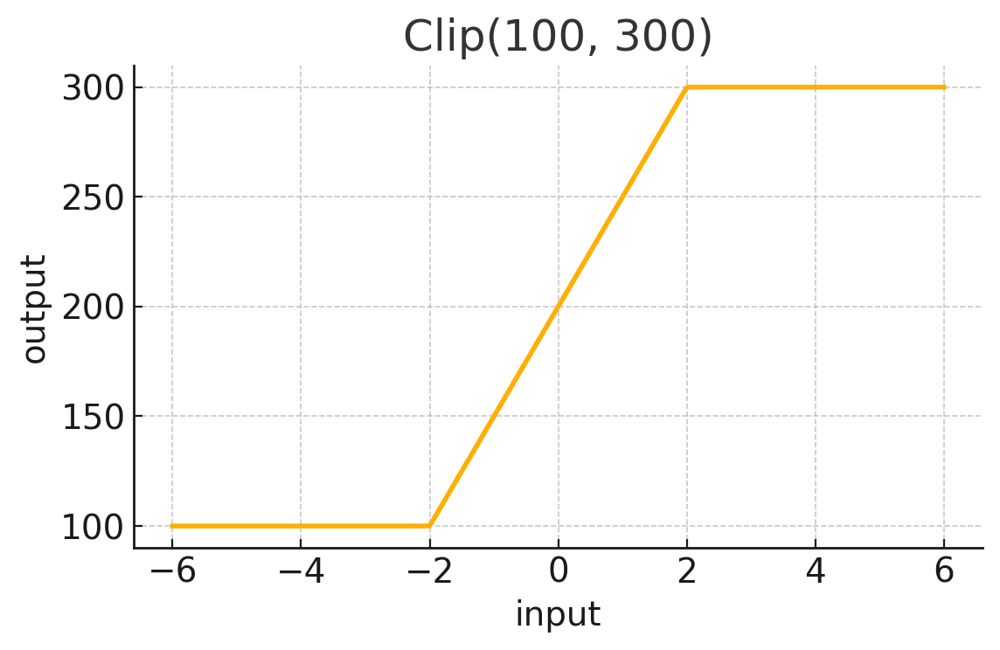
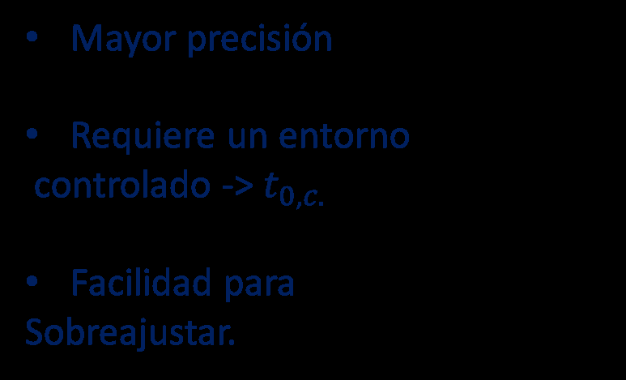
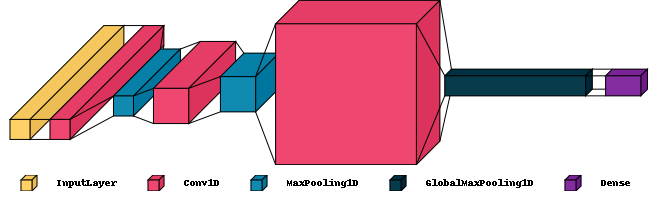
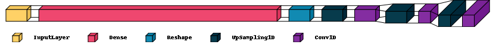
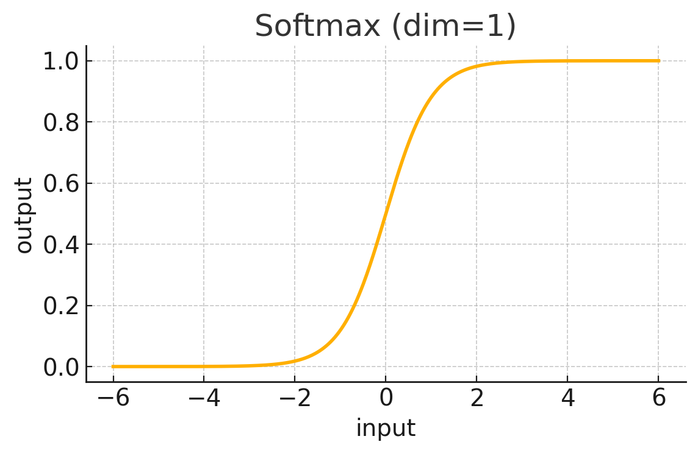
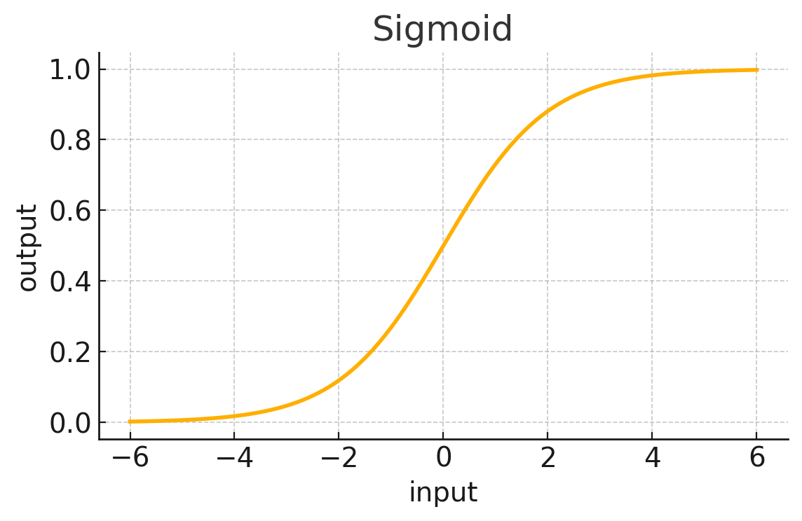

# ML Particle Pulse Reconstruction

Machine-learning pipeline for pulse reconstruction and deconvolution in Micromegas particle detector signals.

This project addresses the reconstruction of detector events from digitized waveforms where multiple pulses may overlap in time. The goal is to recover the underlying event parameters, such as arrival times, amplitudes, and transfer-function coefficients, from convoluted detector signals.

The pipeline combines:

- synthetic detector-like signal generation,
- fixed and variable transfer-function modeling,
- Transformer-based regression,
- post-prediction numerical refinement,
- ROOT waveform reading,
- visualization and reconstruction analysis.

The project is designed as an applied machine learning workflow for particle-detector signal processing.

---

## Table of Contents

- [Overview](#overview)
- [Detector Context](#detector-context)
- [Repository Structure](#repository-structure)
- [Signal Model](#signal-model)
- [Synthetic Data Generation](#synthetic-data-generation)
- [Fixed Transfer Function Approach](#fixed-transfer-function-approach)
- [Variable Transfer Function Problem](#variable-transfer-function-problem)
- [Encoder-Decoder-Regressor Baseline](#encoder-decoder-regressor-baseline)
- [Transformer Specialist Model](#transformer-specialist-model)
- [Output Activations](#output-activations)
- [Post-Prediction Refinement](#post-prediction-refinement)
- [Results](#results)
- [ROOT Data Reading](#root-data-reading)
- [Pretrained Models](#pretrained-models)
- [How to Run](#how-to-run)
- [Requirements](#requirements)
- [Suggested Workflow](#suggested-workflow)
- [Main Concepts](#main-concepts)
- [Notes](#notes)
- [Figure List](#figure-list)

---

## Overview

In many particle-detector systems, the measured waveform is not a single isolated pulse. Instead, the signal can be a superposition of several detector responses arriving at different times and with different amplitudes.

This project treats pulse reconstruction as a supervised machine learning and deconvolution problem.

The main objective is to recover pulse parameters such as:

```text
arrival time
amplitude
transfer-function shape parameters
```

from sampled waveforms.

The final approach combines a Transformer-based neural network with a numerical refinement stage.

---

## Detector Context

Micromegas detectors produce digitized electronic signals associated with particle interactions. In realistic acquisition conditions, several physical events can produce overlapping pulses in the same measured waveform.

This makes direct event reconstruction difficult because a single visible peak may correspond to multiple underlying pulses.

The reconstruction task can be understood as:

```text
measured waveform = detector response * event sequence + noise
```

The objective is to infer the hidden event sequence from the measured waveform.


Each event is represented by a pulse with:

```text
t0  arrival time
A   amplitude
a   response decay coefficient
b   response shape coefficient
```

---

## Repository Structure

```text
ml-particle-pulse-reconstruction/
├── src/
│   ├── activations.py
│   ├── architecture_visualizer.py
│   ├── deconvolution.py
│   ├── result_reader.py
│   ├── root_reader.py
│   ├── sampler.py
│   ├── signal_generator.py
│   └── transformer_model.py
│
├── models/
│   ├── best_model.keras
│   ├── transformer_10_25_5.keras
│   └── transformer_10_25_5perc.keras
│
├── figures/
│   ├── activation_clip_t0.png
│   ├── activation_sigmoid_ab.png
│   ├── activation_softmax_amplitude.png
│   ├── convolved_signal_problem.png
│   ├── decoder.png
│   ├── edr_decoder.png
│   ├── edr_encoder.png
│   ├── encoder.png
│   ├── fixed_transfer_linear_fit.png
│   ├── legend_layers.png
│   ├── post_prediction_refinement.png
│   ├── transformer_legend.png
│   ├── transformer_results_ab.png
│   ├── transformer_results_errors.png
│   ├── transformer_shared_encoder.png
│   └── transformer_specialist_branches.png
│
├── data/
├── results/
├── examples/
├── requirements.txt
└── README.md
```

---

## Signal Model

The simulated waveform is built as a sum of shifted detector responses.

Each pulse is described by:

```text
t0  arrival time
A   amplitude
C   global scale
a   exponential decay parameter
b   power-law shape parameter
```

The detector response is modeled as a causal transfer function:

```text
H(t) = C exp(-a t) t^b sin(t)
```

with time scaling and clipping so that the response is zero before the pulse arrival.

The full signal is:

```text
S(t) = sum_i A_i H(t - t0_i; a_i, b_i, C_i) + noise
```

This creates a controlled environment for testing pulse reconstruction algorithms.

---

## Synthetic Data Generation

The script `src/signal_generator.py` generates labeled synthetic signals.

It creates random pulse configurations with:

- random arrival times,
- random amplitudes,
- variable transfer-function parameters,
- optional additive noise,
- fixed signal length of 512 samples.

The labels contain pulse times, amplitudes, and response parameters. Padding values are used when the number of pulses is smaller than the maximum allowed number.

This synthetic approach makes it possible to train supervised models even when manually labeled detector data are not available.

---

## Fixed Transfer Function Approach

The first approach assumes that the detector transfer function is fixed and known.

Under this approximation, the problem can be transformed into a linear least-squares fit. The pulse positions are searched inside a compact region around an initial estimate, and the amplitudes can be recovered efficiently.


This approach has two main advantages:

- high precision when the transfer function is known,
- low computational cost, dominated by least-squares fitting.

However, it also has important limitations:

- assuming a perfectly known transfer function may be unrealistic,
- the method can be sensitive to noise,
- it becomes less robust when pulse shapes vary between events.

---

## Variable Transfer Function Problem

The more realistic case allows the transfer-function parameters to vary.

Instead of estimating only:

```text
t0, A
```

the model must also estimate:

```text
a, b
```

This makes the problem nonlinear.

A simple least-squares formulation is no longer sufficient because the shape parameters cannot be directly solved as linear coefficients.

This motivates the use of neural networks.

---

## Encoder-Decoder-Regressor Baseline

An initial neural approach is based on an Encoder-Decoder-Regressor architecture.

The encoder compresses the input waveform into a smaller latent representation.


The decoder reconstructs the compressed representation, forming an autoencoder together with the encoder.


A regression head then attempts to extract the target pulse parameters from the latent representation.

This approach works reasonably well for simpler scenarios, but becomes less reliable when the transfer-function parameters vary and several overlapping events must be reconstructed.

The model tends to predict the maximum allowed number of pulses, which motivates a more specialized architecture.

---

## Transformer Specialist Model

The final approach uses a specialist Transformer-like architecture.

The model starts with a shared encoding block that processes the full waveform and extracts a compact representation of the signal.



Then, different prediction branches specialize in different output quantities:

- arrival times `t0`,
- amplitudes `A`,
- transfer-function coefficients `a` and `b`.



This design is motivated by the fact that different pulse parameters have different numerical behavior. Pulse times are bounded, amplitudes must remain positive, and shape parameters vary within a relatively narrow interval.

The architecture includes:

- Conv1D feature extraction,
- dilated convolution,
- multi-head attention,
- residual feed-forward blocks,
- global pooling,
- auxiliary inputs,
- bidirectional LSTM layers,
- constrained output heads.

Additional architecture diagrams:





Layer legend:


---

## Output Activations

Different output variables require different activation strategies.

For pulse times, a clipped activation is used to keep predictions inside the physically allowed time window.


For amplitudes, a softmax-like activation distributes the total predicted amplitude among candidate pulses.


For transfer-function parameters such as `a` and `b`, sigmoid activations are used because these coefficients vary inside a narrow interval.


This output design helps constrain the model to physically meaningful predictions.

---

## Post-Prediction Refinement

The neural network prediction is used as an initial estimate.

A nonlinear numerical refinement stage is then applied to improve the reconstructed parameters.

The refinement alternates between parameter groups:

```text
1. fix two groups of parameters
2. optimize the remaining group
3. repeat for another group
4. iterate until convergence
```


This hybrid approach combines the speed of neural prediction with the accuracy of numerical optimization.

---

## Results

The Transformer-based model is tested on synthetic signals containing up to 10 possible pulses.

The model achieves good reconstruction of the transfer-function coefficients `a` and `b`.



The timing error remains relatively small, while amplitude reconstruction becomes the main bottleneck of the refinement pipeline.



The main observed behavior is:

```text
Delta t < 0.6 samples per pulse
```

while the amplitude error remains larger and is identified as the main limitation of the current approach.

---

## ROOT Data Reading

The script `src/root_reader.py` demonstrates how to read ROOT detector data using `uproot`.

It loads event arrays such as:

```text
timestamp
signal_ids
signal_values
```

and reconstructs channel-wise sampled waveforms.

This part is useful for connecting the synthetic reconstruction pipeline with real or detector-simulation data stored in ROOT format.

ROOT files are not included in this repository.

---

## Pretrained Models

The repository includes pretrained Keras models:

```text
models/
├── best_model.keras
├── transformer_10_25_5.keras
└── transformer_10_25_5perc.keras
```

Recommended default model:

```text
models/best_model.keras
```

New models can be trained using:

```bash
python src/transformer_model.py
```

To resume from an existing checkpoint:

```bash
python src/transformer_model.py --resume
```

If the model files are too large for GitHub, they can be moved to a GitHub Release and referenced from this README.

---

## How to Run

Install dependencies:

```bash
pip install -r requirements.txt
```

Train a new model:

```bash
python src/transformer_model.py
```

Run the sampling and refinement pipeline:

```bash
python src/sampler.py
```

Visualize saved result CSV files:

```bash
python src/result_reader.py
```

Read a ROOT file:

```bash
python src/root_reader.py
```

Generate activation-function plots:

```bash
python src/activations.py
```

---

## Requirements

Main dependencies:

```text
numpy
scipy
pandas
matplotlib
tensorflow
scikit-learn
uproot
visualkeras
```

Install them with:

```bash
pip install -r requirements.txt
```

---

## Suggested Workflow

A typical workflow is:

```text
1. Generate synthetic labeled signals.
2. Train the Transformer-based model.
3. Predict pulse parameters on test signals.
4. Refine predictions with least-squares optimization.
5. Compare reconstructed pulses with ground truth.
6. Apply the same pipeline to ROOT-based detector signals.
```

---

## Future Work

Possible improvements include:

- testing alternative activation functions for amplitude prediction,
- adding a dedicated head to predict the number of pulses,
- improving the post-processing and numerical refinement stage,
- defining confidence intervals for `a`, `b`, and `t0`,
- applying the pipeline to larger sets of ROOT detector waveforms,
- comparing the model against classical sparse deconvolution methods.

---

## Main Concepts

This project covers:

- applied machine learning for detector signals,
- Micromegas detector waveform reconstruction,
- pulse deconvolution,
- synthetic signal generation,
- Transformer-based regression,
- Conv1D feature extraction,
- multi-head attention,
- bidirectional recurrent layers,
- constrained neural outputs,
- numerical least-squares refinement,
- ROOT data reading,
- particle-detector signal processing.

---

## Notes

This repository is intended as an applied machine learning and signal processing project.

The goal is not to provide a final production-ready reconstruction framework, but to explore a hybrid reconstruction method combining neural networks and numerical optimization.

Training data is generated synthetically at runtime, so no external dataset is required to train the model.

Large ROOT datasets are not included in the repository.

---

## Figure List

The README expects the following files inside the `figures/` folder:

```text
figures/
├── activation_clip_t0.png
├── activation_sigmoid_ab.png
├── activation_softmax_amplitude.png
├── convolved_signal_problem.png
├── decoder.png
├── edr_decoder.png
├── edr_encoder.png
├── encoder.png
├── fixed_transfer_linear_fit.png
├── legend_layers.png
├── post_prediction_refinement.png
├── transformer_legend.png
├── transformer_results_ab.png
├── transformer_results_errors.png
├── transformer_shared_encoder.png
└── transformer_specialist_branches.png
```
